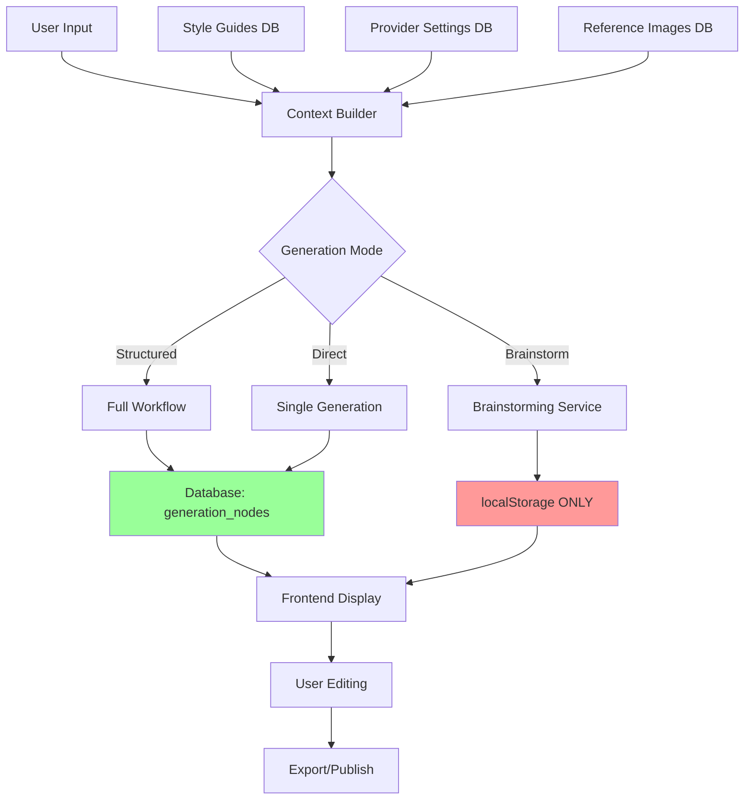

# AI Content Analysis System - Comprehensive Findings Report

**Analysis Date**: September 25, 2025
**Assignment**: Complete analysis of AI content creation capabilities, data persistence, and user workflow
**Analyst**: AI Content Analysis Agent

---

## Executive Summary

The Inteligencia web application features a comprehensive AI content generation system built around a sophisticated database schema with full content creation workflow from brainstorming to published blogs. The system supports multiple AI providers, multi-vertical content creation, and advanced context management with style guides and personas.

**Key Finding**: Brainstormed ideas are **NOT currently being persisted to the database** - they are only stored in browser localStorage, which is a significant limitation for a production content management system.

---

## 1. Database Schema Analysis

### Core AI Tables

The system has a well-designed database schema with 15 AI-related tables:

#### Primary Tables:
- **`generation_nodes`** - Core AI generation tree structure with hierarchical content relationships
- **`style_guides`** - Brand, vertical, writing style, and persona guidelines (4 types)
- **`provider_settings`** - Encrypted API keys for OpenAI, Anthropic, Google, Perplexity
- **`characters`** - Consistent personas for image generation
- **`reference_images`** - Style references, logos, persona images
- **`context_templates`** - Reusable context configurations
- **`image_prompts`** - Extracted and editable image prompts from content
- **`generated_images`** - AI-generated images with metadata
- **`usage_logs`** - Detailed logging for debugging and analytics
- **`generation_analytics`** - Aggregated performance metrics

#### Supporting Tables:
- **`blog_posts`** - Enhanced with AI integration fields
- **`blog_revisions`** - Version history with AI metadata
- **`vertical_visibility_settings`** - Control which sections show per industry

### Database Schema Strengths:
1. **Hierarchical Content Structure**: Parent-child relationships in generation_nodes allow complex content trees
2. **Multi-Provider Support**: Encrypted storage for 4 different AI providers
3. **Comprehensive Context Management**: Style guides, personas, and reference materials
4. **Usage Tracking**: Detailed cost and token usage analytics
5. **Image Generation Integration**: Full workflow from prompts to generated images

---

## 2. AI Generation Capabilities Inventory

### Content Generation Types

The system can generate 8 different content types:

1. **Ideas** (`type: 'idea'`) - Blog post brainstorming
2. **Titles** (`type: 'title'`) - SEO-optimized headlines
3. **Synopsis** (`type: 'synopsis'`) - Engaging blog summaries
4. **Outlines** (`type: 'outline'`) - Structured content plans
5. **Blogs** (`type: 'blog'`) - Full blog posts
6. **Social Media** (`type: 'social'`) - Platform-specific content
7. **Image Prompts** (`type: 'image_prompt'`) - AI image generation prompts
8. **Analysis** (`type: 'analysis'`) - Content analysis and insights

### AI Provider Support

**Supported Providers**:
- **OpenAI** (GPT-4, GPT-4o, GPT-3.5-turbo)
- **Anthropic** (Claude models)
- **Google** (Gemini models)
- **Perplexity** (Research-focused models)

### Generation Modes

**5 Generation Modes Available**:
1. **`structured`** - Full workflow: idea → title → outline → blog
2. **`direct`** - Single-step generation
3. **`batch`** - Multiple outputs at once
4. **`multi_vertical`** - Cross-industry variations
5. **`edit_existing`** - Modify existing content

### Vertical Industry Support

**4 Industry Verticals**:
- **Hospitality** - Tourism, hotels, restaurants
- **Healthcare** - Medical practices, patient care
- **Technology** - Software, SaaS, IT services
- **Athletics** - Sports, fitness, recreation

---

## 3. Backend API Endpoints

### AI Service Endpoints

**Primary Endpoints**:

1. **`/api/ai/brainstorm`** - Generate multiple blog ideas
   - File: `/server/ai/brainstorm.js`
   - Supports: Topic-based idea generation, vertical filtering, tone control
   - Returns: Structured ideas with titles, angles, descriptions, tags

2. **`/api/brainstorm-simple`** - Simplified brainstorming (Vercel API)
   - File: `/api/brainstorm-simple.ts`
   - Uses: OpenAI GPT-3.5-turbo
   - Returns: JSON array of blog ideas

3. **`/server/ai/generate-titles.js`** - SEO-optimized title generation
   - Features: Multiple templates, A/B testing, keyword optimization
   - Templates: how-to, listicle, question, comparison, ultimate, beginner, advanced

4. **`/server/ai/generate-synopsis.js`** - Blog synopsis generation
   - Features: Length control, tone adjustment, hook emphasis
   - Supports: Multiple variations, social media optimization

5. **`/server/ai/social-transform.js`** - Social media content transformation
   - Platforms: Twitter/X, LinkedIn, Facebook, Instagram
   - Features: Platform-specific formatting, character limits, hashtags

6. **`/server/ai/enhance-content.js`** - Content improvement and editing
   - Features: Grammar, style, SEO optimization, readability

7. **`/server/ai/generate-images.js`** - AI image generation
   - Providers: OpenAI DALL-E, Google Imagen
   - Features: Style references, character consistency, prompt enhancement

### Main Generation Service

**`GenerationServiceReal.js`** - Core service with database integration:
- Provider API key decryption
- Style guide context building
- Usage tracking and analytics
- Multi-provider fallback support

---

## 4. Frontend Components Analysis

### Main Dashboard Component

**`AIContentDashboard.tsx`** - Primary interface featuring:
- Provider selection and model switching
- Real-time generation statistics
- Keyboard shortcuts for power users
- Modal system for different generation types
- Loading states and error handling

### Brainstorming Module

**`BrainstormingModule.tsx`** - Comprehensive brainstorming interface:
- Topic input with industry/tone selection
- Advanced options: content types, custom context
- Grid/list view modes with search and filtering
- Favorite/bookmark system (localStorage only)
- Export functionality (JSON, CSV, Markdown)
- **Critical Issue**: No database persistence

### Generation Workflow

**`GenerationWorkspace.tsx`** - Multi-mode content creation:
- Quick mode for simple generations
- Structured mode for full workflow
- Edit mode for content modification
- Tree navigation for complex content hierarchies

### Modals and Specialized Components

1. **`ContextSelectionModal.tsx`** - Context and style guide selection
2. **`StyleGuideModalEnhanced.tsx`** - Style guide management
3. **`MultiVerticalModal.tsx`** - Multi-industry generation
4. **`SocialMediaModal.tsx`** - Social media content creation
5. **`ImageGenerationModal.tsx`** - AI image generation studio
6. **`ContentPlanningModal.tsx`** - 5-step content planning workflow

---

## 5. Content Generation Workflow Analysis

### Complete Content Pipeline

**Workflow Stages**:
1. **Brainstorming** → Generate topic ideas
2. **Title Generation** → Create SEO-optimized headlines
3. **Synopsis Creation** → Write engaging summaries
4. **Outline Development** → Structure content plan
5. **Blog Writing** → Generate full articles
6. **Social Media** → Transform to social posts
7. **Image Generation** → Create visual content

### Context Integration

**Context Sources**:
- **Style Guides**: Brand voice, vertical-specific, writing styles, personas
- **Previous Content**: Reference existing blogs for consistency
- **Reference Images**: Visual style guidance
- **Custom Context**: User-provided additional information

### Data Flow

```
User Input → Context Building → AI Provider → Content Generation →
Database Storage (generation_nodes) → Frontend Display → User Editing →
Final Export/Publish
```

### Multi-Vertical Generation

The system supports parallel content generation across multiple industries:
- **Parallel Mode**: Generate all variations simultaneously
- **Sequential Mode**: Generate one after another
- **Adaptive Mode**: Adjust based on previous results

---

## 6. Data Persistence Analysis - Critical Finding

### ⚠️ Major Issue: Brainstormed Ideas Not Persisted

**Current Implementation**:
- Brainstormed ideas are stored in **browser localStorage only**
- No database persistence for brainstorming sessions
- Data is lost when browser storage is cleared
- No cross-device access to brainstormed ideas

**Evidence**:
```javascript
// From BrainstormingService.js line 134:
localStorage.setItem(`brainstorming-session-${sessionId}`, JSON.stringify(savedIdeas));

// TODO comment on line 136:
// TODO: Save to backend database when implemented
// await this._saveToDatabase(savedIdeas);
```

### Other Content Persistence

**What IS Persisted**:
- Generated blogs → `blog_posts` table
- Generation metadata → `generation_nodes` table
- Style guides → `style_guides` table
- Usage analytics → `usage_logs` and `generation_analytics`
- Image prompts → `image_prompts` table
- Generated images → `generated_images` table

**Database Schema Exists But Unused for Brainstorming**:
- The `generation_nodes` table can handle `type: 'idea'`
- All infrastructure is in place for brainstorming persistence
- Only missing the database save implementation

---

## 7. User Interface and Experience

### Strengths

1. **Comprehensive Dashboard**: Clean, professional interface with real-time stats
2. **Modal-Based Workflow**: Organized generation processes
3. **Keyboard Shortcuts**: Power-user features (Cmd+I for brainstorming, etc.)
4. **Visual Feedback**: Loading states, progress indicators, notifications
5. **Flexible Views**: Grid/list modes, search, filtering, sorting
6. **Export Options**: Multiple formats for generated content

### User Experience Issues

1. **Brainstorming Data Loss**: Major UX issue - ideas disappear when browser storage cleared
2. **No Cross-Device Sync**: localStorage limits accessibility
3. **Modal Complexity**: Multiple overlapping modals could be simplified
4. **No Offline Support**: Requires internet connectivity for all operations

### Navigation Flow

```
Dashboard → Quick Actions → Modal Selection → Configuration →
Generation → Review/Edit → Save/Export → Return to Dashboard
```

---

## 8. Technical Architecture

### Frontend Stack
- **React** with TypeScript
- **Zustand** for state management
- **Tailwind CSS** for styling
- **Lucide React** for icons
- **Error Boundaries** for reliability

### Backend Stack
- **Node.js** with Express-like routing
- **PostgreSQL** database with Drizzle ORM
- **Crypto** for API key encryption
- **Multiple AI SDK integrations**

### Database Integration
- **Drizzle ORM** for type-safe database operations
- **PostgreSQL** with comprehensive indexing
- **Encrypted API key storage** with salt-based security
- **Usage analytics** with cost tracking

---

## 9. Integration Points

### Database Tables Used by AI System

1. **`generation_nodes`** - Core content hierarchy
2. **`style_guides`** - Content guidance and branding
3. **`provider_settings`** - AI provider configurations
4. **`usage_logs`** - Detailed operation logging
5. **`generation_analytics`** - Performance metrics
6. **`blog_posts`** - Final published content
7. **`characters`** - Image generation personas
8. **`reference_images`** - Visual style references

### API Integration Patterns

- **Service Layer**: Clean separation between frontend and AI providers
- **Error Handling**: Comprehensive error boundaries and fallback systems
- **Analytics Tracking**: Every AI operation logged for billing/optimization
- **Security**: Encrypted API keys with proper access controls

---

## 10. Critical Issues and Recommendations

### 🚨 High Priority Issues

1. **Brainstorming Persistence Gap**
   - **Issue**: Ideas not saved to database, only localStorage
   - **Impact**: Data loss, no cross-device access, poor user experience
   - **Recommendation**: Implement database save in `BrainstormingService.js`
   - **Effort**: Low - infrastructure already exists

2. **Session Management**
   - **Issue**: No user session tracking for brainstorming
   - **Impact**: Cannot associate ideas with specific users
   - **Recommendation**: Add user_id field to generation_nodes

### 🔧 Medium Priority Improvements

3. **Offline Support**
   - **Issue**: No offline capabilities
   - **Recommendation**: Implement service worker for basic functionality

4. **Cross-Device Sync**
   - **Issue**: localStorage is device-specific
   - **Recommendation**: Move to database-backed sessions

5. **Modal Complexity**
   - **Issue**: Too many overlapping modals
   - **Recommendation**: Consolidate into tabbed interface

### ✅ Low Priority Enhancements

6. **Advanced Analytics**
   - Add cost optimization recommendations
   - Provider performance comparisons
   - Content effectiveness metrics

7. **Collaboration Features**
   - Team brainstorming sessions
   - Shared style guides
   - Content approval workflows

---

## 11. System Capabilities Matrix

| Capability | Status | Database Integrated | Frontend UI | API Endpoint |
|------------|--------|-------------------|-------------|--------------|
| Brainstorming | ⚠️ Partial | ❌ No | ✅ Yes | ✅ Yes |
| Title Generation | ✅ Complete | ✅ Yes | ✅ Yes | ✅ Yes |
| Synopsis Generation | ✅ Complete | ✅ Yes | ✅ Yes | ✅ Yes |
| Blog Creation | ✅ Complete | ✅ Yes | ✅ Yes | ✅ Yes |
| Social Media | ✅ Complete | ✅ Yes | ✅ Yes | ✅ Yes |
| Image Generation | ✅ Complete | ✅ Yes | ✅ Yes | ✅ Yes |
| Multi-Vertical | ✅ Complete | ✅ Yes | ✅ Yes | ✅ Yes |
| Style Guides | ✅ Complete | ✅ Yes | ✅ Yes | ✅ Yes |
| Usage Analytics | ✅ Complete | ✅ Yes | ✅ Yes | ✅ Yes |

---

## 12. Data Flow Diagram



**Red**: Data loss risk (localStorage only)
**Green**: Proper database persistence

---

## 13. Conclusion

The Inteligencia AI content generation system is **highly sophisticated and well-architected** with comprehensive database design, multiple AI provider integration, and advanced context management. The system supports the complete content creation workflow from ideation to publication.

**However, there is one critical gap**: **Brainstormed ideas are not being persisted to the database**, creating a significant user experience issue and data loss risk.

### Immediate Action Required

The single most important improvement needed is implementing database persistence for brainstormed ideas. The infrastructure already exists - only the service layer connection needs to be implemented.

### Overall System Assessment

- **Database Design**: Excellent (9/10)
- **API Architecture**: Excellent (9/10)
- **Frontend UX**: Good (7/10) - limited by brainstorming persistence issue
- **AI Integration**: Excellent (9/10)
- **Multi-Vertical Support**: Excellent (9/10)
- **Analytics & Monitoring**: Excellent (9/10)

**System Readiness**: 85% complete - ready for production after brainstorming persistence fix.

---

## File References

### Key Database Files
- `/Users/jpmiles/lm-inteligencia/src/db/schema.ts` - Complete database schema
- `/Users/jpmiles/lm-inteligencia/src/db/migrations/0001_add_ai_content_generation_system.sql` - AI system migration
- `/Users/jpmiles/lm-inteligencia/src/db/seeds/aiSeeds.ts` - Initial data seeding

### Backend API Files
- `/Users/jpmiles/lm-inteligencia/server/ai/brainstorm.js` - Main brainstorming endpoint
- `/Users/jpmiles/lm-inteligencia/api/brainstorm-simple.ts` - Simplified brainstorming API
- `/Users/jpmiles/lm-inteligencia/server/ai/generate-titles.js` - Title generation
- `/Users/jpmiles/lm-inteligencia/server/ai/generate-synopsis.js` - Synopsis generation
- `/Users/jpmiles/lm-inteligencia/server/ai/social-transform.js` - Social media transformation
- `/Users/jpmiles/lm-inteligencia/src/services/ai/GenerationServiceReal.js` - Core generation service

### Frontend Component Files
- `/Users/jpmiles/lm-inteligencia/src/components/ai/AIContentDashboard.tsx` - Main dashboard
- `/Users/jpmiles/lm-inteligencia/src/components/ai/modules/BrainstormingModule.tsx` - Brainstorming interface
- `/Users/jpmiles/lm-inteligencia/src/services/ai/BrainstormingService.js` - Frontend brainstorming service
- `/Users/jpmiles/lm-inteligencia/src/services/ai/AIGenerationService.ts` - Frontend API service

---

*Report completed on September 25, 2025*
*Next recommended action: Implement database persistence for brainstormed ideas*